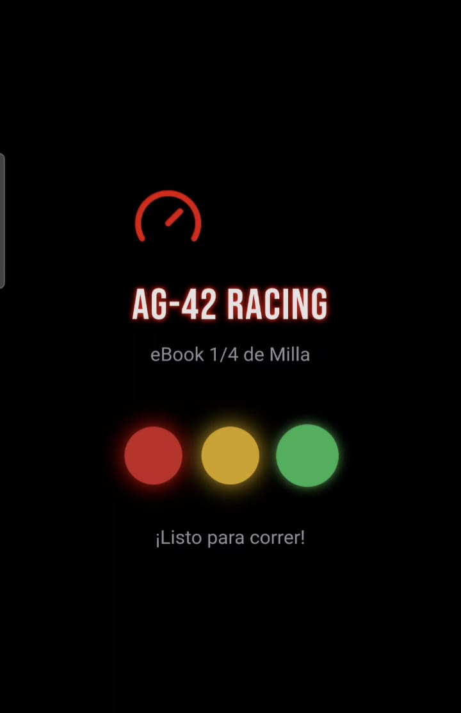
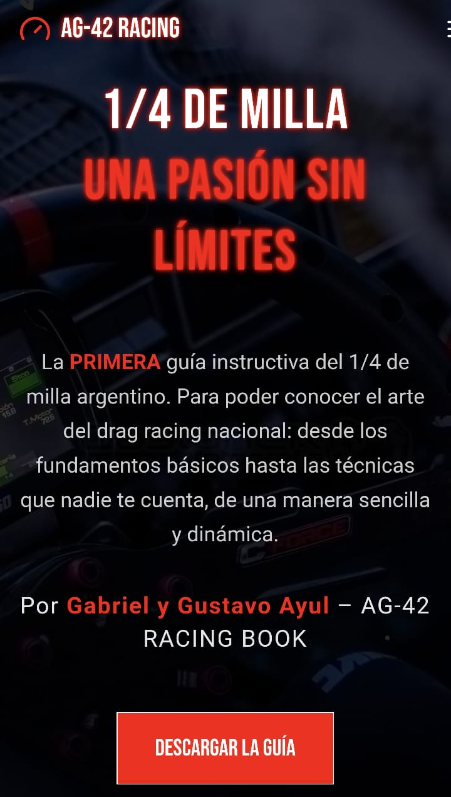
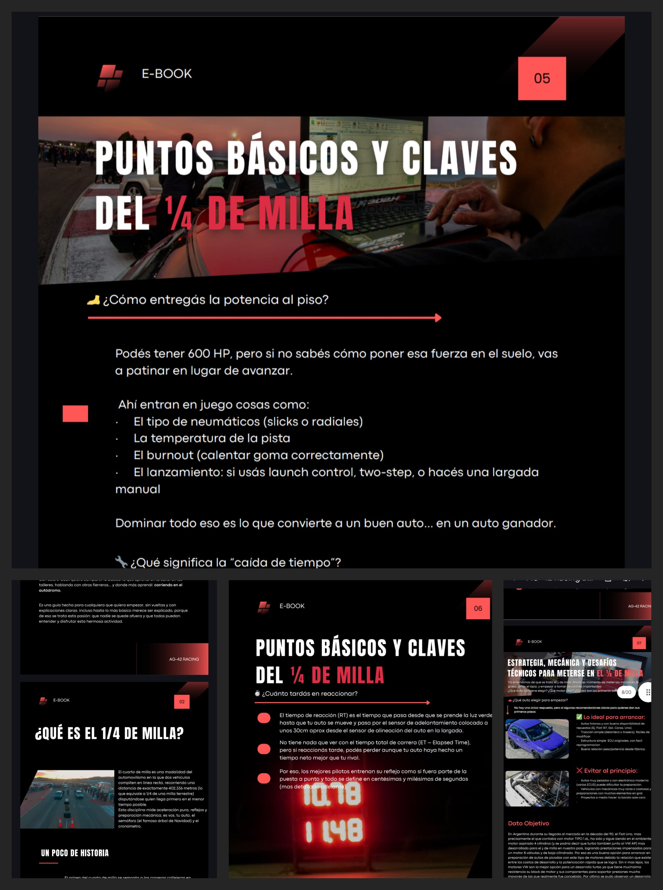

# 🏁 AG42 Racing Book – Primer eBook del ¼ de Milla Argentino 🇦🇷

**Bienvenidos al portfolio oficial del proyecto AG42 Racing Book**, un desarrollo 100% personal que combina más de 20 años de experiencia en automovilismo deportivo con herramientas modernas de inteligencia artificial, diseño y desarrollo web.

---

## 📘 ¿Qué es AG42 Racing Book?

Es la **primera guía instructiva digital del ¼ de milla en Argentina**, pensada para quienes recién comienzan en esta apasionante disciplina. Un eBook claro, directo y accesible para todos los niveles.

---

## 🧰 Tecnologías y herramientas utilizadas

- 🛠️ [Bolt CMS](https://bolt.cm/) – Desarrollo de la landing page
- 🎨 [Canva](https://www.canva.com/) – Diseño visual del eBook y recursos gráficos
- 🤖 **IA Generativa** (ChatGPT + DALL·E) – Asistencia en redacción, estructura y contenido visual
- 🌐 [Netlify](https://www.netlify.com/) – Hosting gratuito para la landing page
- 🛒 [Mercado Pago API](https://www.mercadopago.com.ar/developers/es) – Integración de pagos
- 📂 Google Drive – Entrega automática del eBook tras el pago

---

## 🌐 Sitio Web Oficial

🔗 [https://ag42racingbook.com](https://ag42racingbook.com)

---

## 📷 Capturas del Proyecto

### 🚦 Portada introductoria

### 🏁 Página principal del sitio

### 📘 Vista previa del contenido del eBook

---

## 🎥 Video promocional del proyecto

Podés ver una animación de introducción al estilo semáforo drag aquí:  
👉 [Ver video promocional](docs/Video42.mp4)

(💡 Tip: GitHub no muestra el video incrustado, pero podés descargarlo o abrirlo en otra pestaña)

---

## 🎯 Objetivo del proyecto

> **Demostrar que hoy, con una mínima inversión y gracias a herramientas de IA y diseño accesibles, es posible crear un negocio digital rentable desde cero.**

Este proyecto busca compartir conocimientos, difundir la cultura del ¼ de milla y ofrecer una experiencia dinámica, educativa y profesional para nuevos entusiastas del automovilismo argentino.

---

## 💡 Lecciones aprendidas

- Cómo lanzar un producto digital completo (contenido + diseño + venta)
- Cómo aplicar herramientas sin código y automatizar flujos
- Cómo combinar una pasión con oportunidades reales de monetización

---

## 🤝 Contacto

📩 **Gabriel Ayul**  
📱 WhatsApp: [+54 9 297 413-2691](https://wa.me/5492974132691)  
📧 Email: gayul@interlog.com.ar  
🔗 [LinkedIn](https://www.linkedin.com/in/gabriel-ayul/)  

---

> 🚦 ¡Listo para correr! Este es solo el primer eBook… y vamos por más. Gracias por ser parte de este proyecto.
